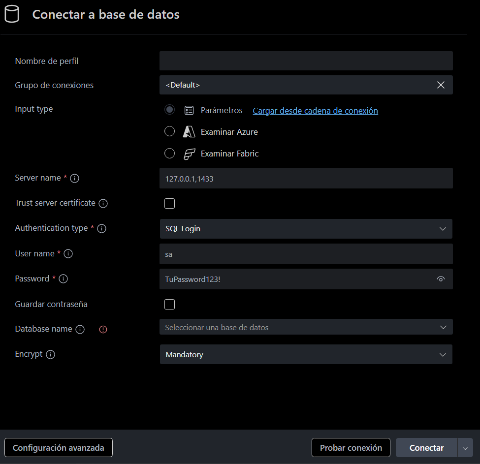
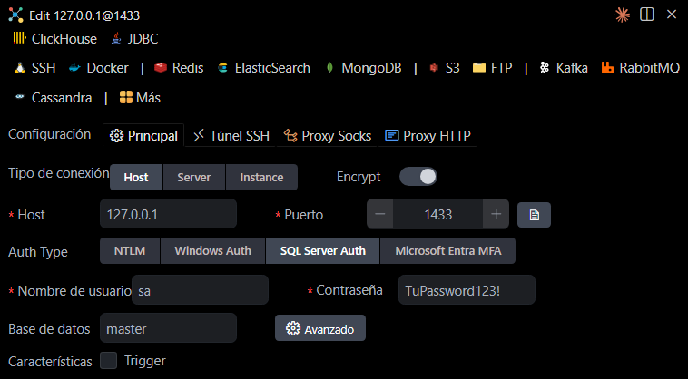

# Práctica de SQL con Docker (SQL Server)

Practicá SQL de forma aislada usando SQL Server en Docker.

## Requisitos obligatorios

- Docker Desktop instalado y corriendo.
- VS Code con **ambas** extensiones:
  1. **MSSQL** / **SQL Server** (mssql) — para ver el esquema y diagramas de la base de datos.
  2. **Database Client** (Weijan Chen): `cweijan.vscode-database-client` — para ejecutar consultas desde el editor.

## Estructura

```estructura
.
├── docker-compose.yml
├── run.ps1
└── ejercicios/<nombre>/
   ├── 01_database.sql     # Creación de la base de datos
   ├── 02_tables.sql       # Creación de tablas
   ├── 03_data.sql         # Inserción de datos
   └── consultas/          # Consultas / respuestas (NO ejecutadas por el script)
       └── respuestas.sql  # o archivos separados por tema
```

## Cómo empezar (lo más simple)

1. **Levantar SQL Server, crear BD, tablas y cargar datos** (todo en un solo comando):

   ```powershell
   .\run.ps1 ejercicios\confiteria
   ```

   El script hace `docker compose up -d`, ejecuta `01_database.sql` → `02_tables.sql` → `03_data.sql` (los archivos de `consultas/` se ejecutan aparte desde VS Code) y deja el contenedor corriendo.

2. **Conectarte desde VS Code** con ambas extensiones:
   - **Host:** `127.0.0.1`
   - **Port:** `1433`
   - **User:** `sa`
   - **Password:** `TuPassword123!`
   - **Database:** `confiteria` (o el nombre del ejercicio)

3. **Abrí los archivos de `ejercicios/<nombre>/consultas/`** y ejecutá las consultas desde el editor usando **Database Client** (Weijan Chen). Para ver el diagrama / esquema de la base de datos usá la extensión **MSSQL / SQL Server** (mssql).

### Configuración de las extensiones en VS Code

| Extensión MSSQL / SQL Server                               | Extensión Database Client (Weijan Chen)         |
| ---------------------------------------------------------- | ----------------------------------------------- |
|  |  |

> **Importante:** los archivos dentro de `consultas/` contienen las soluciones y **no deben subirse al repositorio**. Cada alumno ejecuta sus consultas localmente.

## Ejemplo

`01_database.sql`

```sql
CREATE DATABASE CONFITERIA;
```

`02_tables.sql`

```sql
USE CONFITERIA;
CREATE TABLE MOZOS (
    id INT PRIMARY KEY,
    nombre VARCHAR(50) NOT NULL
);
```

`03_data.sql`

```sql
USE CONFITERIA;
INSERT INTO MOZOS (id, nombre) VALUES (1, 'Juan Perez');
```

Archivos en `consultas/` — ejecutalos desde VS Code con Database Client.

---

Hecho por **Francisco Andrada**
